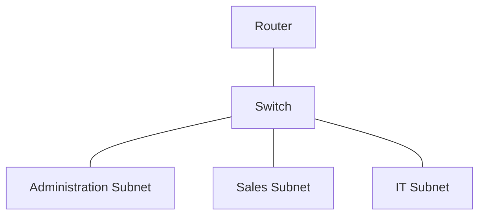

# *Computer Networks and Network Security* Final Project

In the final project, you will apply the core networking and security concepts learned throughout the course. Working as a Network Technician for TechSafe Ltd., you will design, analyze, and secure a real-world organizational network through a series of hands-on tasks.

TechSafe, Ltd. has hired you to design and secure its network. The company uses a fixed IP address from its Internet service provider (ISP) and wants a structured network with compatible IP addressing, subnetting, and security configurations.
> [!NOTE]
> Command-line tools replaced GUI tools in this project, as command-line tools offer more stable interfaces and often expose more detailed OS or application APIs.

---
## Task 1: Design a network with subnets
### Scenario
Design a network diagram for TechSafe Ltd that includes three departments: Administration, Sales, and IT. Each department requires its own subnet.
### Answer

---
## Task 2: Calculate Subnet Addresses and Subnet Masks
### Scenario
You are working with a fixed IP address of 198.51.100.0/24. The network is divided into three subnets with the following IP address ranges for each department:    
- Administration: 198.51.100.1 - 198.51.100.62
- Sales: 198.51.100.65 - 198.51.100.126
- IT: 198.51.100.129 - 198.51.100.190

Your task is to calculate each department's subnet addresses and subnet masks based on their specified IP address ranges and save that information into a text-based table for later use.
### Answer

| Subnet Name    | Subnet Address    | Subnet Mask     | IP Address Range                |
| -------------- | ----------------- | --------------- | ------------------------------- |
| Administration | 198.51.100.0/26   | 255.255.255.192 | 198.51.100.1 - 198.51.100.62    |
| Sales          | 198.51.100.64/26  | 255.255.255.192 | 198.51.100.65 - 198.51.100.126  |
| IT             | 198.51.100.128/26 | 255.255.255.192 | 198.51.100.129 - 198.51.100.190 |

---
## Task 3: Analyze HTTP/HTTPS Website Traffic Using Wireshark
### Scenario
After implementing the network design in Task 1 and configuring the IP addresses and subnets during Task 2, TechSafe Ltd. needs you to monitor network usage related to website that their employees might access. Your task is to capture and analyze HTTP/HTTPS traffic from one of the following websites to identify and understand the data flow related to these two services.

Use Wireshark to capture live network traffic on your system while you visit Wikipedia. Spend at least 2 minutes actively browsing both sites.

Apply the following filters in Wireshark:
- Since these websites use HTTPS, filter the captured traffic for HTTPS by applying a filter for tcp port 443.
- Add additional filter conditions to search for tcp containing these websites to isolate packets related to these domains.
- In this example, let's use the example of Wikipedia. The final filter will look like this: `tcp.port==443 and tcp contains "Wikipedia"`.
- Analyze the filtered traffic to identify the domains, URLs, or types of content being accessed on Wikipedia.
### Answer
#### Step 1: Confirm authorization and prepare the evidence directory
```bash
mkdir -p "$PWD/techsafe-task3"
cd "$PWD/techsafe-task3"
date -u '+%Y-%m-%dT%H:%M:%SZ' | tee collection-start-utc.txt
```
#### Step 2: Confirm required Linux tools
```bash
command -v dumpcap
command -v tshark
command -v curl
```
#### Step 3: Identify active capture interface
```bash
dumpcap -D
ip route get 1.1.1.1
```
The first command lists capture interfaces. The second command shows the interface Linux would use for outbound traffic. Record the matching interface number from `dumpcap -D`, and replace `1` below if another number is correct.
```bash
CAPTURE_INTERFACE=1
```
#### Step 4: Capture 150 seconds of DNS and TCP port 443 traffic
Open the first terminal in the evidence directory, and run:
```bash
sudo dumpcap \
  -i "$CAPTURE_INTERFACE" \
  -f 'tcp port 443 or port 53' \
  -a duration:150 \
  -w wikipedia-https.pcapng
```
#### Step 5: Generate Wikipedia traffic for at least two minutes
While the first terminal is capturing, open a second terminal in the same directory. Run the following loop.
```bash
while IFS= read -r url
do
  date -u '+time=%Y-%m-%dT%H:%M:%SZ'
  curl \
    --http1.1 \
    --location \
    --silent \
    --show-error \
    --output /dev/null \
    --write-out 'url=%{url_effective} status=%{http_code} content_type=%{content_type} remote_ip=%{remote_ip}\n' \
    "$url"
  sleep 30
done <<'URLS' | tee wikipedia-access.log
https://en.wikipedia.org/wiki/Main_Page
https://en.wikipedia.org/wiki/Computer_security
https://en.wikipedia.org/wiki/Network_security
https://en.wikipedia.org/wiki/Wireshark
URLS
```
#### Step 6: Isolate visible Wikipedia TLS ClientHello records
First, run the display filter:
```bash
tshark \
  -r wikipedia-https.pcapng \
  -Y 'tcp.port == 443 and tcp contains "Wikipedia"' \
  | tee wikipedia-assignment-filter.txt
```
Record whether this filter returned any rows.
Next, run a protocol-aware filter:
```text
tcp.port == 443 and tls.handshake.extensions_server_name contains "wikipedia.org"
```
Run the filter with `tshark`, and export the available packet metadata:
```bash
tshark \
  -r wikipedia-https.pcapng \
  -Y 'tcp.port == 443 and tls.handshake.extensions_server_name contains "wikipedia.org"' \
  -T fields \
  -E header=y \
  -E separator=, \
  -E quote=d \
  -e frame.number \
  -e frame.time_epoch \
  -e ip.src \
  -e ipv6.src \
  -e ip.dst \
  -e ipv6.dst \
  -e tcp.srcport \
  -e tcp.dstport \
  -e tcp.stream \
  -e tls.handshake.extensions_server_name \
  > wikipedia-tls-clienthello.csv
```
Display the result:
```bash
column -s, -t wikipedia-tls-clienthello.csv
```
#### Step 7: Identify the related TCP streams
```bash
tshark \
  -r wikipedia-https.pcapng \
  -Y 'tcp.port == 443 and tls.handshake.extensions_server_name contains "wikipedia.org"' \
  -T fields \
  -e tcp.stream \
  | sort -n -u \
  | tee wikipedia-streams.txt
```
For each stream number in `wikipedia-streams.txt`, replace `STREAM_NUMBER` in the command below. This view shows the connection sequence, endpoints, flags, TLS records, and packet sizes for the selected stream.
```bash
tshark \
  -r wikipedia-https.pcapng \
  -Y 'tcp.stream == STREAM_NUMBER' \
  -T fields \
  -E header=y \
  -E separator=, \
  -E quote=d \
  -e frame.number \
  -e frame.time_epoch \
  -e ip.src \
  -e ipv6.src \
  -e ip.dst \
  -e ipv6.dst \
  -e tcp.srcport \
  -e tcp.dstport \
  -e tcp.flags \
  -e frame.len \
  -e _ws.col.Protocol
```
If the filter returns no rows, check that the correct interface was captured, confirm that the curl requests succeeded, and inspect DNS answers and remote IP addresses. Encrypted ClientHello, a proxy, a VPN, or missing packets can hide the server name.
## Task 4: Configure Firewall Rules Using Microsoft Windows Defender Firewall

### Scenario
TechSafe Ltd. wants to further secure its internal network by restricting access to specific types of web traffic. To enhance security, you must configure Microsoft Windows Defender Firewall to block all FTP and HTTP traffic.
### Answer
#### Step 1: Open elevated PowerShell and create an evidence directory
Open Start, search for PowerShell, select Run as administrator, and confirm the User Account Control prompt. Run:
```powershell
$EvidenceDirectory = Join-Path $PWD 'techsafe-task4'
New-Item -ItemType Directory -Path $EvidenceDirectory -Force
Set-Location $EvidenceDirectory
Get-Date -AsUTC -Format 'yyyy-MM-ddTHH:mm:ssZ' | Tee-Object -FilePath '.\collection-start-utc.txt'
```
#### Step 2: Record active firewall profiles and existing matching rules
```powershell
Get-NetFirewallProfile |
  Select-Object Name, Enabled, DefaultInboundAction, DefaultOutboundAction |
  Format-Table -AutoSize |
  Out-String |
  Tee-Object -FilePath '.\firewall-profile-before.txt'
```

```powershell
Get-NetFirewallRule -ErrorAction SilentlyContinue |
  Where-Object DisplayName -Like 'TechSafe Block Outbound*' |
  Format-Table DisplayName, Enabled, Direction, Action, Profile -AutoSize |
  Out-String |
  Tee-Object -FilePath '.\matching-rules-before.txt'
```
#### Step 3: Test FTP before applying the rule
```powershell
Test-NetConnection -ComputerName 'ftp.dlptest.com' -Port 21 -InformationLevel Detailed |
  Tee-Object -FilePath '.\ftp-before.txt'
```
Record `TcpTestSucceeded`. If it is `False` before the rule exists, the later posttest cannot prove that Windows Defender Firewall caused the failure. Check DNS resolution, endpoint availability, upstream filtering, and lab instructions before continuing.
#### Step 4: Create outbound FTP block rule
```powershell
New-NetFirewallRule `
  -DisplayName 'TechSafe Block Outbound FTP 21' `
  -Description 'Blocks outbound FTP control connections to TCP remote port 21 for the TechSafe lab' `
  -Direction Outbound `
  -Action Block `
  -Protocol TCP `
  -RemotePort 21 `
  -Profile Any
```
#### Step 5: Verify FTP rule configuration
```powershell
Get-NetFirewallRule -DisplayName 'TechSafe Block Outbound FTP 21' |
  Select-Object DisplayName, Enabled, Direction, Action, Profile |
  Format-List |
  Out-String |
  Tee-Object -FilePath '.\ftp-rule.txt'
```

```powershell
Get-NetFirewallRule -DisplayName 'TechSafe Block Outbound FTP 21' |
  Get-NetFirewallPortFilter |
  Select-Object Protocol, LocalPort, RemotePort |
  Format-Table -AutoSize |
  Out-String |
  Tee-Object -FilePath '.\ftp-port-filter.txt'
```
The output should show an enabled outbound block rule with TCP remote port 21.
#### Step 6: Test FTP after applying the rule
```powershell
Test-NetConnection -ComputerName 'ftp.dlptest.com' -Port 21 -InformationLevel Detailed |
  Tee-Object -FilePath '.\ftp-after.txt'
```
The FTP control is validated only if the pretest succeeded, the rule configuration is correct, and the posttest fails while the rule is enabled.
#### Step 7: Test HTTP before applying the rule
Use both a TCP test and an HTTP request. The TCP test isolates port reachability. The web request confirms an application-layer HTTP response.
```powershell
Test-NetConnection -ComputerName 'httpforever.com' -Port 80 -InformationLevel Detailed |
  Tee-Object -FilePath '.\http-tcp-before.txt'
```

```powershell
try {
  $Response = Invoke-WebRequest -Uri 'http://httpforever.com/' -UseBasicParsing -TimeoutSec 15 -ErrorAction Stop
  $Response |
    Select-Object StatusCode, StatusDescription |
    Format-List |
    Out-String |
    Tee-Object -FilePath '.\http-request-before.txt'
}
catch {
  $_.Exception.Message | Tee-Object -FilePath '.\http-request-before.txt'
}
```
If both pretests fail, stop and resolve the baseline failure before creating the HTTP rule.
#### Step 8: Create outbound HTTP block rule
```powershell
New-NetFirewallRule `
  -DisplayName 'TechSafe Block Outbound HTTP 80' `
  -Description 'Blocks outbound unencrypted HTTP connections to TCP remote port 80 for the TechSafe lab' `
  -Direction Outbound `
  -Action Block `
  -Protocol TCP `
  -RemotePort 80 `
  -Profile Any
```
#### Step 9: Verify the HTTP rule configuration
```powershell
Get-NetFirewallRule -DisplayName 'TechSafe Block Outbound HTTP 80' |
  Select-Object DisplayName, Enabled, Direction, Action, Profile |
  Format-List |
  Out-String |
  Tee-Object -FilePath '.\http-rule.txt'
```

```powershell
Get-NetFirewallRule -DisplayName 'TechSafe Block Outbound HTTP 80' |
  Get-NetFirewallPortFilter |
  Select-Object Protocol, LocalPort, RemotePort |
  Format-Table -AutoSize |
  Out-String |
  Tee-Object -FilePath '.\http-port-filter.txt'
```

The output should show an enabled outbound block rule with TCP remote port 80.
#### Step 10: Test HTTP after applying the rule
```powershell
Test-NetConnection -ComputerName 'httpforever.com' -Port 80 -InformationLevel Detailed |
  Tee-Object -FilePath '.\http-tcp-after.txt'
```

```powershell
try {
  $Response = Invoke-WebRequest -Uri 'http://httpforever.com/' -UseBasicParsing -TimeoutSec 15 -ErrorAction Stop
  $Response |
    Select-Object StatusCode, StatusDescription |
    Format-List |
    Out-String |
    Tee-Object -FilePath '.\http-request-after.txt'
}
catch {
  $_.Exception.Message | Tee-Object -FilePath '.\http-request-after.txt'
}
```
The HTTP control is validated only if the baseline succeeded, the rule configuration is correct, and the posttest fails while the rule is enabled. HTTPS on TCP port 443 should remain available because the rule targets remote TCP port 80.