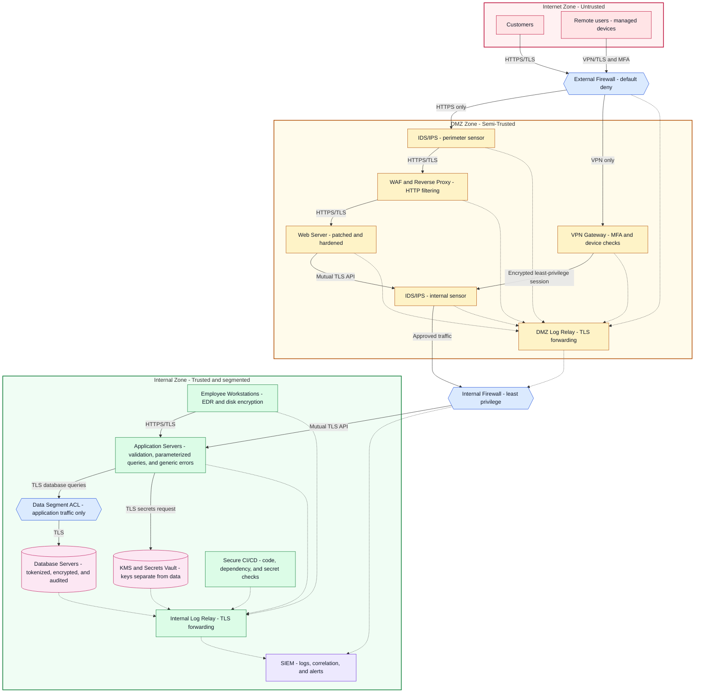

# *Cybersecurity Architecture* Final Project
## Scenario
Jackson Corporation, a growing organization with both internal and customer-facing systems, has recently experienced a surge in cyberthreat activity. These threats may include unauthorized access attempts, data breaches, malware infections, and web application attacks. Concerned about the potential impact on its operations, reputation, and customer trust, the company has hired a security professional to assess its current infrastructure and recommend improvements.

The organization operates a mixed environment that includes internal networks, web servers, remote users, and custom-developed web applications. While the current setup supports business operations and collaboration, it lacks many essential security controls expected in a modern enterprise environment. The absence of layered defenses, centralized monitoring, and secure development practices places Jackson Corporation at significant risk of both internal and external attacks.

The company has hired you to evaluate its existing infrastructure and recommend security enhancements. After reviewing the existing network and processes, you have identified various concerns. Below table these concerns by component.

| Network Component                                | Findings                                                                                                                                                                                                                                                                                                                                                                                                                                                                                                                                                                                                                                                                                                                                                                                                                                                                                                                                                                                                                                                                                                                                                                                                                                                                                                                                                                                                                                                |
| ------------------------------------------------ | ------------------------------------------------------------------------------------------------------------------------------------------------------------------------------------------------------------------------------------------------------------------------------------------------------------------------------------------------------------------------------------------------------------------------------------------------------------------------------------------------------------------------------------------------------------------------------------------------------------------------------------------------------------------------------------------------------------------------------------------------------------------------------------------------------------------------------------------------------------------------------------------------------------------------------------------------------------------------------------------------------------------------------------------------------------------------------------------------------------------------------------------------------------------------------------------------------------------------------------------------------------------------------------------------------------------------------------------------------------------------------------------------------------------------------------------------------- |
| **1. Firewall**                                  | Currently, Jackson Corporation has only one firewall that indiscriminately filters both external traffic from the internet and internal traffic from within the organization. This setup poses a potential risk as it does not allow for targeted security protocols based on the traffic source.                                                                                                                                                                                                                                                                                                                                                                                                                                                                                                                                                                                                                                                                                                                                                                                                                                                                                                                                                                                                                                                                                                                                                       |
| **2. Web servers**                               | Jackson Corporation's web server is located internally within the organization's primary network. This setup means that the server, a crucial and sensitive asset, is exposed to the same potential risks as the rest of the internal network. In terms of security, a basic firewall is the only mechanism in place for protecting the web server. This singular firewall is tasked with filtering both incoming external traffic and internal traffic within the network, creating a potential vulnerability.                                                                                                                                                                                                                                                                                                                                                                                                                                                                                                                                                                                                                                                                                                                                                                                                                                                                                                                                         |
| **3. Network monitoring**                        | Jackson Corporation's network infrastructure currently consists of wired and wireless networks. All devices, including employee workstations, servers, and other digital assets, are interconnected within this network, facilitating seamless data exchange and collaboration. There is no comprehensive system to centrally monitor, log, and analyze the security events happening across the entire network. While this interconnected setup allows for operational efficiency, it also opens potential vulnerabilities that internal or external threats can exploit. Currently, there is no comprehensive system in place. This limitation makes threat detection and incident response slower and less efficient, leaving the corporation at increased risk.                                                                                                                                                                                                                                                                                                                                                                                                                                                                                                                                                                                                                                                                                     |
| **4. Breach detection**                          | As it currently stands, Jackson Corporation primarily relies on a basic network monitoring system. This system monitors the traffic and the network's performance but lacks an advanced threat detection mechanism. The current network monitoring setup involves regular checks on the network's health, performance statistics, and traffic volume. However, it does not provide detailed analysis or real-time alerts about potential security threats, anomalies, or suspicious activities within the network. While this setup allows for maintaining basic network performance and identifying bandwidth, latency, or server downtime issues, it falls short in proactively identifying and mitigating potential security threats. As a result, the company might not be able to detect a cyberthreat until after a breach has occurred. This reactive approach to network security puts the corporation's sensitive data and digital assets at significant risk.                                                                                                                                                                                                                                                                                                                                                                                                                                                                                 |
| **5. Remote work**                               | As Jackson Corporation expands globally, its workforce becomes increasingly remote and mobile. Employees frequently travel or work from home, needing to access the corporation's internal resources from different parts of the world. Users are currently using shared resources using web-based tools. However, accessing these resources over public or unsecured networks poses significant security risks. The data exchanged could be intercepted and compromised by malicious entities. In this context, the absence of a secure remote access solution could potentially limit the productivity and efficiency of the corporation's mobile workforce while also exposing the corporation's internal resources to unnecessary security risks.                                                                                                                                                                                                                                                                                                                                                                                                                                                                                                                                                                                                                                                                                                   |
| **6. Software development**                      | Jackson Corporation currently follows a traditional waterfall approach to software development. The coding process begins with clear-cut requirements that the development team translates into functional code. Developers code in isolation, focusing primarily on the software's functionality, with little consideration for potential security vulnerabilities. Code reviews are not a regular practice and are typically only conducted on an ad hoc basis when a problem arises. The final product is then passed on to a separate team for testing before it's ready for deployment. The current process creates gaps in understanding and practicing secure coding principles. Without focusing on security from the outset and regular code reviews, vulnerabilities could be overlooked and make their way into the deployed software. This could potentially provide an avenue for cyberthreats to compromise the application and the data it handles.                                                                                                                                                                                                                                                                                                                                                                                                                                                                                      |
| **7. Web application security (OWASP Concerns)** | During the security audit, several common web application vulnerabilities were discovered in Jackson Corporation's customer portal and internal web applications. These issues align with common OWASP security risks.  **Issue A: Weak password policy** - The system allows users to create simple passwords like "password123" or "12345678". There are no requirements for password complexity (such as requiring uppercase letters, numbers, or special characters), and there is no minimum length requirement beyond 6 characters.    **Issue B: Unencrypted sensitive data** - Customer credit card information and social security numbers are stored in the database in plain text format (not encrypted). If an attacker gains access to the database, they can easily read all this sensitive information.    **Issue C: No input validation** - The search box and contact forms on the website accept any type of input without checking or cleaning it. Users can type special characters and code into these fields, which could allow attackers to inject malicious code into the system.    **Issue D: Detailed error messages** - When something goes wrong on the website, error messages display detailed technical information including database names, file paths, and system configuration details. This information could help attackers understand how the system works and find ways to exploit it. |

---
## Recommendations
Jackson Corporation’s non-segmented environment creates paths from an internet-facing service, remote account, or infected workstation to sensitive systems. Its most urgent risks are plain-text personal and payment data, weak authentication, unvalidated input, and inadequate threat detection. It needs segmented networks, an isolated web tier, secure remote access, centralized logs, endpoint and network detection, and secure development. Controlled testing should accompany each change to protect availability.
### Security Recommendations
#### 1. Firewall
Replace the single control point with a redundant perimeter firewall pair and internal firewalls or access-control lists between user, server, database, management, wireless, and guest zones. Permit only documented business flows. Use default-deny rules, outbound filtering, anti-spoofing, and separate administration. Log decisions, review rules quarterly, remove expired exceptions, and require approved changes with rollback plans.
#### 2. Web Servers
Move public servers into a demilitarized zone (DMZ). Place a reverse proxy and web application firewall (WAF) before them, allow required HTTPS traffic, and block direct internet access to application and database tiers. Permit administration only from a management zone with multifactor authentication (MFA). Patch and harden software, remove unused services, restrict outbound connections, protect secrets in a vault, install endpoint protection, and test backups. Confirm isolation through route, rule, and connection tests.
#### 3. Network Monitoring
Inventory assets and log sources, then send security events to a security information and event management (SIEM) platform. Collect firewall, WAF, remote-access, identity, DNS, server, database, endpoint, wireless, application, and cloud logs. Synchronize clocks, preserve raw events, restrict access, define risk-based retention, and alert when collectors fail. Baseline normal traffic and authentication, then report coverage, failed logins, policy changes, and unusual transfers.
#### 4. Breach Detection
Add controls that detect malicious behavior rather than only performance problems. Place network intrusion detection sensors at the internet edge, DMZ, and internal boundaries. Enable prevention only after tuning. Install endpoint detection and response (EDR) on workstations and servers, then correlate endpoint, identity, WAF, DNS, and firewall events in the SIEM. Detect perimeter reconnaissance, authentication attacks, privilege escalation, malware, lateral movement, persistence, and unusual data transfers. Each alert needs severity criteria, an owner, a playbook, an escalation path, and on-call coverage. Validate detections with authorized simulations and measure coverage, quality, and response times.
#### 5. Remote Work
Use zero-trust network access or a managed enterprise VPN. Never expose internal services directly. Require phishing-resistant MFA, single sign-on, least-privilege access, and reauthentication for sensitive actions. Admit only enrolled, patched devices with EDR, full-disk encryption, screen locks, and health checks. Filter DNS or web traffic and log every session. Make split tunneling a documented risk decision.
#### 6. Software Development
Build security into the lifecycle instead of waiting for final testing. Define security requirements, classify data, model threats, train developers, assign a security champion, and require peer review for changes. Protect branches and separate development, test, and production. The delivery pipeline should scan for secrets, insecure code, and vulnerable dependencies, then run security tests. Higher-risk applications also need dynamic testing and an independent penetration test. Assign every finding an owner and deadline, verify fixes, maintain a software bill of materials, and use a secrets manager. 
#### 7. Web Application Security (OWASP Concerns)
**Issue A - Weak password policy:** Require 15 characters minimum for password-only accounts and 8 when used with MFA. Permit 64 or more characters and passphrases. Block common or breached passwords, rate-limit attempts, and alert users to suspicious logins. Prefer length over arbitrary composition rules, and change passwords when compromise is suspected rather than on a fixed schedule. Store them with a salted adaptive hash such as Argon2id.

**Issue B - Unencrypted sensitive data:** Minimize collection and retention. Replace card numbers with payment-provider tokens where possible and mask displayed values. Encrypt required Social Security numbers and payment data at the field level with authenticated encryption such as AES-GCM, and use TLS in transit. Store and rotate keys in a separate key-management service, restrict decryption by role, audit access, and protect backups.

**Issue C - No input validation:** Treat browser, API, file, and partner input as untrusted. Server-side rules must allow only expected types, lengths, ranges, formats, and business values. Reject invalid input safely. Use parameterized queries instead of SQL string construction. Apply context-specific output encoding for HTML, JavaScript, or URLs. Client-side checks support usability but cannot enforce security. Log repeated failures without recording sensitive content.

**Issue D - Detailed error messages:** Use a global exception handler. Show users a message such as “We could not complete your request,” the correct HTTP status, and a non-sensitive correlation ID. Never expose stack traces, database statements, file paths, versions, secrets, or configuration. Send details to restricted logs and the SIEM.
### Implementation, Ownership, and Verification
Now (0-30 days): The CISO should sponsor protection of stored sensitive data, MFA, generic errors, server-side input controls, restricted web-to-database flows, and central logging.

Next (31-90 days): Network Engineering should build the DMZ and segmentation. IT and Security should deploy EDR, SIEM detections, and managed remote access. Engineering should add development gates.

Later (90-180 days): Tune alerts, review rules, run incident and recovery exercises, and commission an application test.

Owners should retain approved configurations and rollback plans. Verification should cover firewall paths, log-source coverage, backup restoration, MFA, endpoint and infrastructure posture, detection simulations, pipeline results, and retesting all four web findings. Residual risk remains until unknown assets and data flows are identified and controls are continually reviewed.

---
## Create a Security Architecture Diagram for Jackson Corporation
Jackson Corporation has accepted your security recommendations from the previous  assignment. Now they need to see how these improvements will fit together in an actual architecture.

Your task is to create a security architecture diagram that shows:
- How the infrastructure will be restructured
- Where new security controls will be placed
- How traffic will flow through the secured environment
- Where critical assets will be protected
---
## Architecture Diagram
### Exercise 1: Plan the architecture
#### Task A: Security zones
1. Internet Zone - Untrusted: customers, remote users, and hostile traffic.
2. DMZ Zone - Semi-Trusted: boundary controls, IDS/IPS, WAF, VPN, web, and log-relay services.
3. Internal Zone - Trusted and segmented: employee, application, restricted data, and management/SOC segments. Every access still requires authorization and an approved route.
#### Task B: Component-to-zone map
| Recommendation area | Components and placement | Placement rationale |
| --- | --- | --- |
| Firewall | External firewall at Internet-DMZ, internal firewall at DMZ-Internal, and data ACL | Default-deny rules block direct access and limit lateral movement. |
| Web servers | WAF, reverse proxy, and hardened web server in DMZ | Separates exposed hosts from applications and data. |
| Network monitoring | SIEM in Management/SOC, with TLS log relays in DMZ and Internal | Protected central telemetry supports investigation. |
| Breach detection | IDS/IPS at both DMZ choke points and EDR on hosts | Combines network and host detection. |
| Remote work | VPN in DMZ, with MFA, device checks, and least-privilege rules | Terminates untrusted sessions before authorization. |
| Software development | Secure CI/CD in Management, with review, code, dependency, and secret checks | Stops defects before signed production releases. |
| Web application security | WAF in DMZ, secure input handling in Application, and encryption plus KMS in Data | Layers boundary, application, and data protections. |
#### Task C: Major traffic flows
1. Customer -> external firewall -> perimeter IDS/IPS -> WAF -> web server via HTTPS/TLS.
2. Web server -> internal IDS/IPS -> internal firewall -> application server via mutual TLS.
3. Application server -> data ACL -> database via TLS and service identity.
4. Remote user -> firewall -> VPN -> IDS/IPS -> internal firewall -> approved application via VPN/TLS, MFA, and endpoint checks.
5. Workstation -> application via HTTPS/TLS. No workstation or internet path reaches the database.
6. Boundary, DMZ, host, application, database, and CI/CD events -> SIEM through TLS log relays.
### Exercise 2: Security architecture diagram

The WAF screens malicious HTTP patterns and rate-limits abuse, but it does not replace secure code. Applications enforce server-side validation, parameterized queries, and generic errors. The database uses tokenization, field encryption with AES-GCM, role-based access, and audit logging. KMS keeps keys separate from data.

The web server is in DMZ, and the database is behind external, internal, and data controls. No external user reaches Internal directly, and no workstation reaches the database. Major paths are encrypted, and SIEM receives telemetry from every zone.
#### Security annotations and legend
| Encoding or control         | Meaning                                                    |
| --------------------------- | ---------------------------------------------------------- |
| Red, amber, and green zones | Untrusted Internet, semi-trusted DMZ, and trusted Internal |
| Blue hexagon                | Firewall or ACL boundary                                   |
| Pink cylinder               | Sensitive data or keys                                     |
| Purple node                 | Central SIEM                                               |
| Solid arrow                 | Approved traffic with protocol or encryption               |
| Dotted arrow                | TLS log or alert telemetry                                 |
