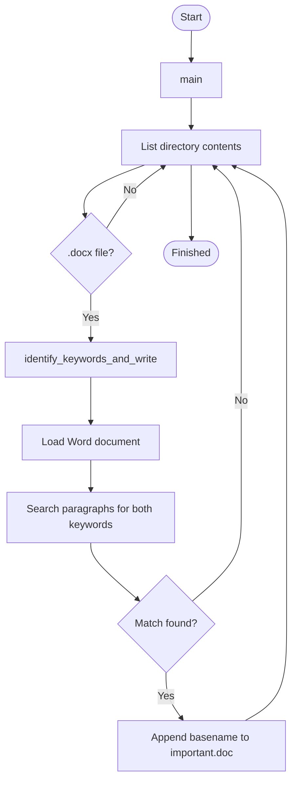

# *Generative AI: Boost Your Cybersecurity Career* Final Project
As a security analyst at the fictional organization 'International Fusion Tech Power Corporation Limited,' you're on a critical mission. Scientists reported suspicious emails, prompting a comprehensive analysis to unveil a potential phishing attack. Your scrutiny extends to certain scientists' systems, revealing a background program.

Further investigations uncovered a network log exposing suspicious activities across the organization. Your focus now is to analyze the log, identify the primary remote IP address, and determine associated port numbers for communication. Subsequently, you're tasked with preparing an incident report to inform management.

The analysis reveals a phishing attack compromising systems. With no playbook in place, you turn to ChatGPT for assistance. Your role is vital in crafting an effective playbook to manage and mitigate the impact of this sophisticated phishing and malware attack, safeguarding the organization's critical infrastructure.
## Exercise 1: Spam email detection
As a Security Analyst at the nuclear power generation organization, you have been informed that several scientists within the organization have reported receiving suspicious emails from unknown senders. Some scientists have flagged these emails as suspicious, and you have been tasked with conducting a comprehensive analysis to determine whether the emails constitute a phishing attack on the organization.

<details><summary>Email</summary>
Subject: Urgent Research Collaboration Opportunity - Exclusive Nuclear Insights!

Dear Dr. Simson,

We hope this message finds you well. Our esteemed organization, the International Nuclear Fusion Advancements Consortium (INFAC), has recently come across ground breaking research that aligns perfectly with your expertise. We believe your involvement is crucial for the success of this venture.

Attached to this email, you will find a PDF document containing detailed information on the collaborative project. Your swift review and valuable insights are of utmost importance to us.

Download the PDF now: [www.infac.com/proposal.pdf](http://www.infac.com/proposal.pdf)

Your commitment to nuclear research has garnered widespread recognition, and we are confident that your expertise will play a pivotal role in advancing our shared goals.

Please respond at your earliest convenience to confirm your participation. We eagerly await your esteemed contribution to this unprecedented initiative.

Best Regards,

Dr. Smith

Director of Collaborative Research

International Nuclear Fusion Advancements Consortium (INFAC)
</details>

## Answer
### AI Prompt
> You are a cybersecurity analyst with 10 years of experience. Assessed the attached email for indicators of phishing. Check if any URLs in the email are malicious using VirusTotal. Check for embedded images or other assets and evaluate if they are malware or ad-ware. Identify and provide details on any canary tokens. Check with LinkedIn and other authoritative online sources for the validity of any asserted individual or organisational identities. Provide a response in less than 250 words.

> [!NOTE]
> The email was provided without headers, which when crossed-referenced with threat intelligence is a more heavily-weighted indicator in phishing assessments than linguistic analysis.
### AI Response
**Assessment: Likely Phishing (High Confidence)**
- **Social engineering indicators:** Uses urgency (“Urgent”, “swift review”), excessive flattery, and an unsolicited research collaboration to encourage immediate action. These are common phishing tactics.
- **Identity validation:** No credible evidence was found that an **International Nuclear Fusion Advancements Consortium (INFAC)** exists as a recognized research organization, nor that **Dr. Smith, Director of Collaborative Research, INFAC** is associated with a legitimate institution. Searches of authoritative sources (including LinkedIn) did not corroborate the organization or individual.
- **URL analysis:** The email links to `http://www.infac.com/proposal.pdf`. Uses **HTTP**, not HTTPS. The domain and organization cannot be validated from authoritative sources. I could not verify a current VirusTotal reputation for this URL/domain from available sources, so it should be treated as **untrusted** until scanned directly in VirusTotal.
- **Attachments/assets:** The email references a PDF but does **not** include the attachment or embedded images. Without the actual file, malware/adware analysis is not possible.
- **Canary tokens:** No canary token indicators (e.g., tracking pixel URLs, unique beacon URLs, Canarytokens.org patterns, or embedded remote assets) are visible in the provided email. Full header and MIME analysis would be required to rule out hidden tracking.

**Recommendation:** Do **not** open the linked PDF or click the URL. Obtain the original `.eml`/`.msg` file and any attachment for header analysis, URL reputation checks, PDF detonation, and IOC extraction.
## Exercise 2: Code analysis of a malware program
You became suspicious of certain scientists' systems. Upon analysis, you discovered a program running in the background. After conducting reverse engineering, you obtained the code stored in the file `malicious.txt`.
```python
from docx import Document
import os

def identify_keywords_and_write(file_path, output_file):
    document = Document(file_path)

    has_keywords = any("nuclear" in paragraph.text.lower() and "research" in paragraph.text.lower() for paragraph in document.paragraphs)

    if has_keywords:
        with open(output_file, 'a') as output:
            output.write(os.path.basename(file_path) + '\n')

def process_directory(directory_path, output_file):
    for filename in os.listdir(directory_path):
        if filename.endswith(".docx"):
            file_path = os.path.join(directory_path, filename)
            identify_keywords_and_write(file_path, output_file)

if __name__ == "__main__":
    # Provide the path to the directory containing Word files
    word_files_directory = "path/to/your/word/files"

    # Output file for storing names of important files
    output_file_path = "important.doc"

    for file_name in os.listdir(word_files_directory):
        if file_name.endswith(".docx"):
            file_path = os.path.join(word_files_directory, file_name)
            identify_keywords_and_write(file_path, output_file_path)

    print("Process completed. Check 'important.doc' for results.")
```
Now, perform a code analysis using AI to identify the actions and potential harm caused by this program to the organization.
## Answer
### AI Prompt
> You are a cybersecurity engineer with 10 years of experience. Analyse the following code and identify if it is malicious. If it is malicious, describe its function in less than 250 words and draw a data flow diagram of the code in Mermaid.
> [CODE]

### AI Response
**Verdict:** This code is **not inherently malicious**. It behaves like a simple document triage or content indexing script. It scans Microsoft Word (`.docx`) files in a directory, searches for paragraphs containing both the words **"nuclear"** and **"research"** (case-insensitive), and records the filenames of matching documents in an output file.

That said, this pattern could be **used as a reconnaissance component** in a larger malicious workflow if an attacker modified it to search for sensitive keywords before exfiltrating files. On its own, however, the script does **not**:
- Exfiltrate data over the network.
- Encrypt, modify, or delete documents.
- Execute arbitrary code.
- Escalate privileges or establish persistence.
- Access anything beyond the specified directory.
### Behavior Summary
1. Enumerates files in a specified directory.
2. Opens each `.docx` document.
3. Checks whether any paragraph contains both `"nuclear"` and `"research"`.
4. If a match is found, appends the document's filename to `important.doc`.
5. Prints a completion message.
### Data Flow Diagram (Mermaid)



**Risk assessment:** **Low.** The script performs local content inspection and filename logging only. Its behavior is consistent with document classification or indexing rather than malware. Context matters, however: if embedded within a larger program that later uploads or acts on the identified files, it could serve as a reconnaissance stage.
## Exercise 3: Network log analysis for threat intelligence
After detecting a malicious program on a system, you discover a network log revealing suspicious activities across multiple computers within the organization. Your task now is to analyze the log, pinpoint the remote IP address that the majority of compromised computers are communicating with, and determine the associated port numbers for these communications.

<details> <summary>Logs</summary>

Timestamp: 2024-01-15 14:30:00
Source IP: 101.123.171.5
Destination IP: 186.20.20.27
Protocol: TCP
Port: 21
Description: Outbound connection from compromised system. Unusual high traffic to known malicious IP.

...

Timestamp: 2024-01-15 14:31:10
Source IP: 101.123.171.8
Destination IP: 176.30.30.27
Protocol: UDP
Port: 5000
Description: Suspicious outbound traffic detected. Unusual activity to known malicious IP.

...

Timestamp: 2024-01-15 15:45:22
Source IP: 101.123.171.15
Destination IP: 186.20.20.27
Protocol: TCP
Port: 8080
Description: Abnormal traffic pattern detected from compromised system. Connection to known malicious IP.

...

Timestamp: 2024-01-15 16:20:45
Source IP: 101.123.171.20
Destination IP: 176.30.30.27
Protocol: ICMP
Description: Potential outbound ICMP traffic from compromised system. Suspicious activity to known malicious IP.

...

Timestamp: 2024-01-15 16:35:00
Source IP: 101.123.171.3
Destination IP: 186.20.20.27
Protocol: UDP
Port: 123
Description: Unusual outbound UDP traffic detected from compromised system. Connection to known malicious IP.

...

Timestamp: 2024-01-15 17:10:15
Source IP: 101.123.171.12
Destination IP: 176.30.30.27
Protocol: TCP
Port: 8080
Description: Outbound connection with high traffic from compromised system. Connection to known malicious IP.

...

Timestamp: 2024-01-15 17:45:30
Source IP: 101.123.171.18
Destination IP: 186.20.20.27
Protocol: UDP
Port: 5000
Description: Suspicious outbound traffic detected. Unusual activity to known malicious IP.

...

Timestamp: 2024-01-15 18:20:45
Source IP: 101.123.171.7
Destination IP: 176.30.30.27
Protocol: TCP
Port: 21
Description: Outbound connection from compromised system. Unusual high traffic to known malicious IP.

...

Timestamp: 2024-01-15 18:35:00
Source IP: 101.123.171.14
Destination IP: 186.20.20.27
Protocol: ICMP
Description: Potential outbound ICMP traffic from compromised system. Suspicious activity to known malicious IP.

...

Timestamp: 2024-01-15 19:10:15
Source IP: 101.123.171.19
Destination IP: 176.30.30.27
Protocol: UDP
Port: 123
Description: Unusual outbound UDP traffic detected from compromised system. Connection to known malicious IP.

...

Timestamp: 2024-01-15 19:45:30
Source IP: 101.123.171.6
Destination IP: 186.20.20.27
Protocol: TCP
Port: 8080
Description: Abnormal traffic pattern detected from compromised system. Connection to known malicious IP.

...

Timestamp: 2024-01-15 20:20:45
Source IP: 101.123.171.11
Destination IP: 176.30.30.27
Protocol: UDP
Port: 5000
Description: Suspicious outbound traffic detected. Unusual activity to known malicious IP.

...

Timestamp: 2024-01-15 20:35:00
Source IP: 101.123.171.16
Destination IP: 186.20.20.27
Protocol: TCP
Port: 21
Description: Outbound connection from compromised system. Unusual high traffic to known malicious IP.

...

Timestamp: 2024-01-15 21:10:15
Source IP: 101.123.171.2
Destination IP: 176.30.30.27
Protocol: ICMP
Description: Potential outbound ICMP traffic from compromised system. Suspicious activity to known malicious IP.

...

Timestamp: 2024-01-15 21:45:30
Source IP: 101.123.171.9
Destination IP: 186.20.20.27
Protocol: UDP
Port: 123
Description: Unusual outbound UDP traffic detected from compromised system. Connection to known malicious IP.

...

Timestamp: 2024-01-15 22:20:45
Source IP: 101.123.171.13
Destination IP: 176.30.30.27
Protocol: TCP
Port: 8080
Description: Outbound connection with high traffic from compromised system. Connection to known malicious IP.

...

Timestamp: 2024-01-15 22:35:00
Source IP: 101.123.171.17
Destination IP: 186.20.20.27
Protocol: UDP
Port: 5000
Description: Suspicious outbound traffic detected. Unusual activity to known malicious IP.

...

Timestamp: 2024-01-15 23:10:15
Source IP: 101.123.171.4
Destination IP: 176.30.30.27
Protocol: TCP
Port: 21
Description: Outbound connection from compromised system. Unusual high traffic to known malicious IP.

...

</details>

## Answer
### AI Prompt
> You are a cybersecurity engineer with 10 years of experience. Analyse the following network log for malicious behaviour and cross reference with available threat intelligence. Respond in less than 250 words.
[> [LOGS]
### AI Response
The log shows a strong pattern of **coordinated outbound communications** from multiple internal hosts (`101.123.171.0/24`) to two recurring external IPs (`186.20.20.27` and `176.30.30.27`). This resembles **command-and-control (C2)** or **botnet** activity rather than isolated compromise.

Key indicators:
- Multiple hosts communicate with the same two destinations over several hours, suggesting lateral compromise or centralized control.
- Use of diverse protocols (TCP, UDP, ICMP) and ports (21, 123, 5000, 8080) indicates protocol agility, a common evasion technique.
- TCP/21 may indicate FTP-based exfiltration, TCP/8080 is frequently abused for HTTP-based C2, UDP/5000 can support proprietary malware communications, UDP/123 may indicate NTP abuse or covert channels, and ICMP may be used for tunneling or beaconing.
- The repeated descriptions of “compromised system” and “known malicious IP” elevate confidence to **High Severity**.

Threat intelligence assessment: I cannot independently verify that `186.20.20.27` or `176.30.30.27` are currently listed as malicious in public threat feeds based on available data, so the “known malicious IP” designation should be validated against sources such as Microsoft Defender TI or Google Threat Intelligence. These platforms provide reputation, infrastructure associations, and historical observations for IP indicators.

**Recommended actions:** Immediately isolate affected hosts, block both destination IPs at perimeter controls, collect EDR/network telemetry, inspect for persistence and lateral movement, acquire memory/disk evidence, rotate potentially exposed credentials, and hunt for additional communications matching these IOCs across the environment.
## Exercise 4: Incident report writing
Prepare an incident report to inform the management about the identified incident.
### AI Prompt
> You are a cybersecurity engineer with 10 years of experience. Produce an incident report of less than 500 words to inform management about the incident identified from the logs. Line management has technical cybersecurity experience, higher management has general GRC experience but not specific cybersecurity experience. Produce the report in a formal incident response template aligned with ISO/IEC 27035. Format the report as a PDF.

### AI Response
[Information Security Incident Report](files/Information%20Security%20Incident%20Report.md)
## Exercise 5: Playbook generation for phishing and malware attack
Having conducted the analysis, it's apparent that your organization has become a target of a phishing attack, leading to systems compromised by malware. With no existing playbook for handling such attacks, you now seek assistance to craft a playbook that effectively manages and mitigates the impact of phishing and malware attacks, utilizing the capabilities of AI.
### AI  Prompt
> You are a cybersecurity engineer with 10 years of experience and an incident response specialist. Create a practical phishing and malware incident response playbook aligned with ISO/IEC 27035.
> 
> Context:
> - Organization: International Fusion Tech Power Corporation Limited
> - Critical infrastructure organization handling sensitive nuclear research.
> - A phishing email was delivered to multiple scientists.
> - Several users interacted with the phishing email.
> - Malware was discovered on multiple endpoints.
> - Network analysis identified outbound communications from compromised hosts to suspicious remote IP addresses over TCP, UDP, and ICMP.
> - The organization has EDR, email security, SIEM, firewall, Active Directory, and endpoint isolation capabilities.
> 
> Produce a playbook in less than 1,000 words containing:
> 1. Purpose
> 2. Scope
> 3. Roles and responsibilities
> 4. Detection and analysis
> 5. Containment
> 6. Eradication
> 7. Recovery
> 8. Post-incident activities
> 9. Indicators of Compromise (IOCs)
> 10. AI-assisted activities
> 11. Communication and escalation procedures
> 12. Lessons learned and metrics
> 
> Present the playbook in a clear table format with actionable steps.
### AI Response
#### Phishing and Malware Incident Response Playbook

| **Section**                         | **Actions**                                                                                                                                                                                                                                                                                                                                                                                                          |
| ----------------------------------- | -------------------------------------------------------------------------------------------------------------------------------------------------------------------------------------------------------------------------------------------------------------------------------------------------------------------------------------------------------------------------------------------------------------------- |
| **Purpose**                         | Provide a standardized process for detecting, containing, eradicating, recovering from, and learning from phishing attacks resulting in malware infections.                                                                                                                                                                                                                                                          |
| **Scope**                           | Applies to all employees, contractors, endpoints, servers, email systems, cloud services, and research networks owned by International Fusion Tech Power Corporation Limited.                                                                                                                                                                                                                                        |
| **Roles & Responsibilities**        | **SOC Analyst:** Detect and triage alerts. **Incident Response Lead:** Coordinate response and decision-making. **IT Operations:** Isolate and restore systems. **Threat Intelligence:** Validate IOCs. **Management:** Approve business-impacting actions. **Communications:** Coordinate internal/external messaging.                                                                                              |
| **Detection & Analysis**            | Monitor SIEM, EDR, IDS/IPS, and email gateway alerts. Analyze email headers, attachments, URLs, endpoint telemetry, process execution, persistence mechanisms, and outbound network connections. Correlate events with threat intelligence and identify affected users and systems.                                                                                                                                  |
| **Containment**                     | Immediately isolate compromised endpoints using EDR. Disable compromised accounts and revoke active sessions. Block malicious domains, URLs, hashes, and IP addresses on firewalls, proxies, DNS filtering, and email gateways. Preserve volatile evidence before system shutdown where appropriate.                                                                                                                 |
| **Eradication**                     | Remove malware using EDR or forensic tools. Delete malicious files, scheduled tasks, registry persistence, and unauthorized services. Reset credentials for affected users and privileged accounts. Patch exploited vulnerabilities and update security signatures. Verify no persistence remains through additional scans.                                                                                          |
| **Recovery**                        | Restore affected systems from trusted backups if required. Reconnect systems only after validation. Monitor endpoints for at least 14 days for recurring activity. Confirm business services operate normally before closing the incident.                                                                                                                                                                           |
| **Post-Incident Activities**        | Conduct a lessons-learned meeting within five business days. Update detections, firewall rules, email filtering, awareness training, and incident documentation. Record timeline, root cause, business impact, and remediation actions.                                                                                                                                                                              |
| **Indicators of Compromise (IOCs)** | Suspicious sender domains, phishing URLs, malicious attachment hashes, unusual PowerShell execution, unauthorized scheduled tasks, outbound connections to suspicious IP addresses, unexpected TCP/8080, TCP/21, UDP/5000, UDP/123, and ICMP beaconing, abnormal authentication events, and newly created privileged accounts.                                                                                       |
| **AI-Assisted Activities**          | Use AI to summarize phishing emails, extract IOCs, classify malware behavior, correlate SIEM events, generate YARA/Sigma detection rules for analyst review, recommend containment actions, draft incident reports, and assist with threat hunting queries. All AI-generated outputs must be reviewed and approved by a security analyst before implementation.                                                      |
| **Communication & Escalation**      | Notify the Incident Response Lead immediately upon confirmation. Escalate critical incidents affecting multiple users or critical systems to executive management. Inform Legal, Compliance, and HR where required. Notify regulators, partners, or customers only through approved communication channels and in accordance with legal obligations. Maintain an incident log documenting all actions and decisions. |
| **Lessons Learned & Metrics**       | Measure Mean Time to Detect (MTTD), Mean Time to Respond (MTTR), number of compromised hosts, phishing reporting rate, containment time, recovery time, recurrence rate, and user training completion. Review metrics quarterly to improve detection capabilities and response effectiveness.                                                                                                                        |
|                                     |                                                                                                                                                                                                                                                                                                                                                                                                                      |
###### Success Criteria
- All compromised endpoints isolated within **30 minutes** of confirmation.
- Malicious indicators blocked across security controls within **1 hour**.
- All affected credentials reset before systems are returned to service.
- Systems restored only after malware-free verification.
- Incident report completed within **48 hours**.
- Lessons-learned review completed within **5 business days**.
- Detection rules, playbooks, and user awareness training updated following every confirmed phishing incident.

This playbook aligns with the incident response lifecycle described in **NIST SP 800-61 Rev. 2** and the incident management principles of **ISO/IEC 27035**, while incorporating AI as a decision-support capability under human oversight.